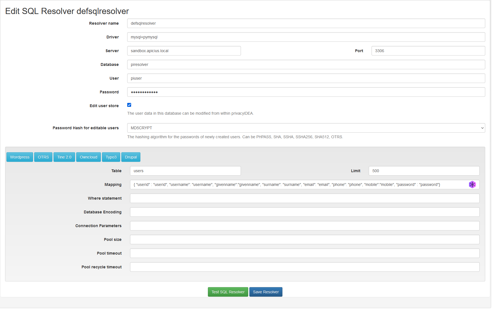
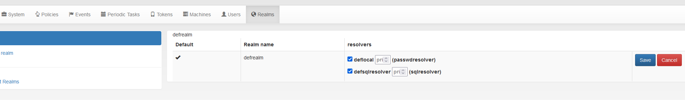
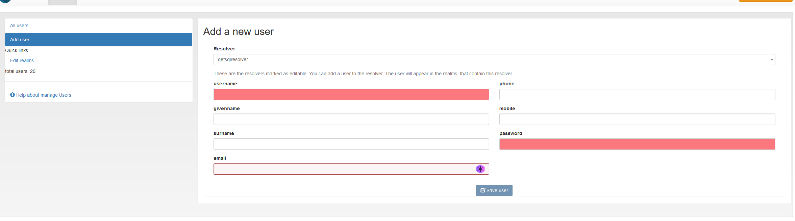
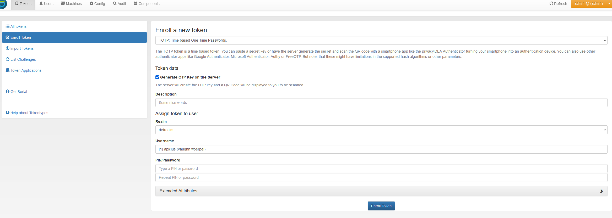

# MFA Lab - CSEC 465: Authentication

## Setting up the privacyIDEA server and MySQL

Using docker, deploy the privacyIDEA container provided [here](https://github.com/Khalibre/privacyidea-docker).

```bash
sudo docker run -p 80:80 \
                -p 443:443 \
                -d -ti --name=privacyidea-dev \ 
                --env-file=secretkey \ 
                --env-file=pipepper \ 
                --detached khalibre/privacyidea:dev
```

Then, deploy a MySQL server with remote access on either your privacyIDEA host or on another local server.

```bash
sudo mysql -u root -p 

CREATE DATABASE pisqlresolver;

CREATE USER 'piuser'@'localhost' IDENTIFIED BY 'password';
CREATE USER 'piuser'@'%' IDENTIFIED BY 'password';
GRANT PRIVILEGE ON pisqlresolver.* TO 'piuser'@'localhost';
GRANT PRIVILEGE ON pisqlresolver.* TO 'piuser'@'%';

USE pisqlresolver;

CREATE TABLE users(
    userid INT NOT NULL AUTO_INCREMENT,
    username VARCHAR(50) NOT NULL,
    givenname VARCHAR(50),
    surname VARCHAR(50),
    phone VARCHAR(50),
    mobile VARCHAR(50),
    email VARCHAR(50),
    password VARCHAR(100) NOT NULL,
    PRIMARY KEY (userid));

exit
```

Make sure to set the bind address for mysql using the config files in /etc/mysql to 0.0.0.0 if intending to access from a remote host.

## Configuring privacyIDEA

### Resolver

Set up the SQL Resolver to point to your database under `Config > Users > New SQLResolver`



Mapping: 
```
{ "userid": "userid", "username": "username", "givenname": "givenname", "surname": "surname", "email": "email", "phone": "phone", "mobile": "mobile", "password": "password"}
```

Then, add the resolver to the realm under `Config > Realms > All Realms > defrealm > Edit > defsqlresolver`



### User

Once the resolver has been set up, a user can be added under `Users > Add User`



### TOTP

Finally, you can add your TOTP (Timed-based One-time Password)

Navigate to `Tokens > Enroll Tokens > Select TOTP in the first dropdown`



Make sure to not set the PIN/Password, or it will require a pin in conjunction with the TOTP. This is already being accomplished with a password.

On the next page, it privacyIDEA will show you the QR code. Scanning the QR code with Google Authenticator, it can then be used for authentication.

## Website

Set your environment variables:

```bash
export JWT_SECRET_KEY=VALUE
export AUTH_ADMIN=VALUE
export AUTH_PASSWORD=VALUE
```

Install the requirements:

```bash
pip3 install -r requirements.txt
```

Now run it!
```bash
python3 app.py
```
